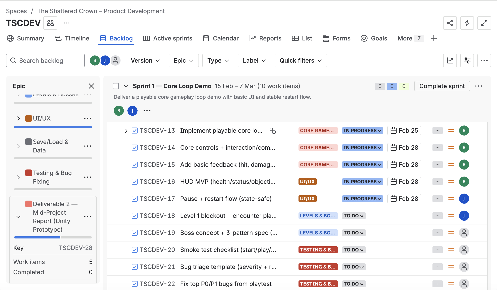
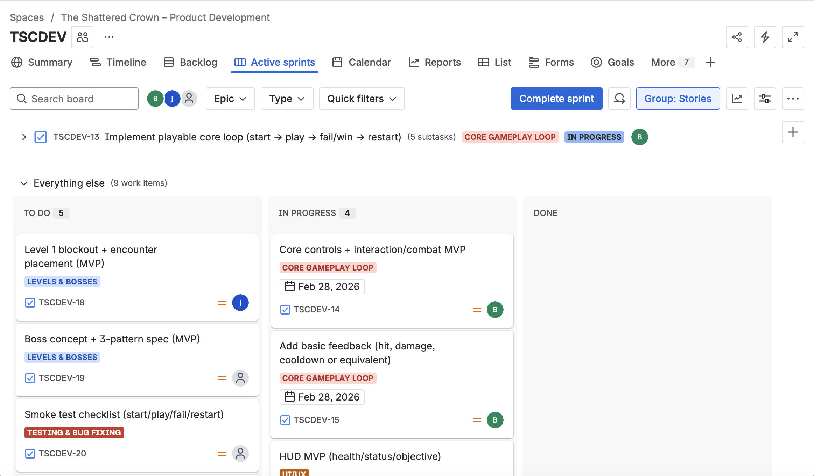
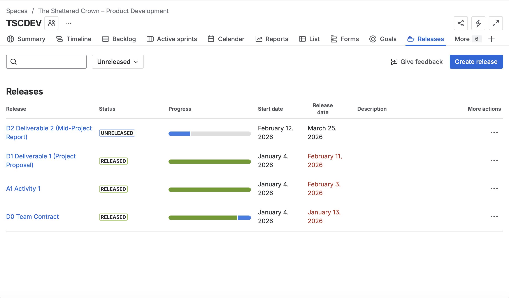

# The Shattered Crown

### Agile Product Delivery Governance (Jira)

> Designed and executed a structured Agile delivery framework in Jira, simulating an enterprise product environment with milestone governance, risk control, and stakeholder transparency.

---

## 📊 Delivery Snapshot

| Metric             | Result   |
| ------------------ | -------- |
| Duration           | 4 Months |
| Sprint Cycles      | 5        |
| Epics Managed      | 7        |
| Work Items         | 70+      |
| Major Deliverables | 4        |
| On-Time Milestones | 100%     |

---

## 🏗 Governance Framework

### Backlog Architecture

Deliverables → Epics → Stories → Subtasks
Enabled vertical traceability and controlled scope expansion.

---

### Sprint Execution

Implemented time-boxed sprint cadence with clear Definition of Done and capacity-aware allocation.
Maintained predictable velocity across 5 sprint cycles.

---

### Milestone & Release Oversight

Version-controlled major deliverables with structured release tracking to ensure accountability and timeline integrity.

---

### Risk Management

Established a formal risk register with impact scoring, ownership assignment, and mitigation monitoring.

---

## 👤 Leadership & Ownership

* Designed full Jira governance structure
* Defined backlog decomposition methodology
* Structured sprint planning and milestone control
* Implemented risk monitoring process
* Maintained stakeholder-facing delivery transparency

---

## 🎯 Demonstrated Capabilities

* Agile Delivery Governance
* Milestone Execution Management
* Stakeholder Communication
* Risk-Controlled Planning
* Structured Work Decomposition

---

## 🛠 Tools

Jira · Scrum · Agile · Git · GitHub
